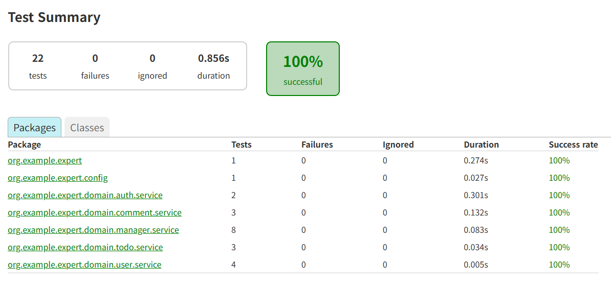

# 💡 [Spring 6기] Spring 심화 주차 개인 과제

### 🕰️ 개발 기간
25.04.15 - 25.04.21

## ✏️과제 내용
### <필수> 
1. 코드개선
   -  Early Return
   -  불필요한 if-else 피하기
   -  Validation
3. N+1문제
   - N+1 문제 해결 방법
5. 테스트코드 연습
   - 성공 케이스 오류 수정
   - 예외처리 케이스 오류 수정
풀이내용은 readme 아래에 있음.

### <도전>
1. API 로깅
   -  Interceptor와 AOP를 활용한 API 로깅
3. 문제 정의 및 해결
   - <a href= "https://velog.io/@tofha054/Spring-심화-개인-과제-Lv.5-코드-개선"> 풀이 링크 </a>
5. 테스트 커버리지

서비스 레이어만 테스트 코드 작성했습니다.

 
 
# 📚 과제 풀이 과정
## 필수 Lv.1
### 1. Early Return
비밀번호 암호화나 다른 값들을 꺼내서 객체를 만들기 전에 가입을 할 수 있는 전제조건을 확인하도록 한다.

  
### 2. Rid of if-else
이미 if문을 만족하는 조건은 throw으로 메서드가 종료되기 때문에 아래의 else문이 필요하지 않다.
- (※ 커밋 실수로 `2. Rid of if-else` 와 `3. Validation`가 서로 바뀌어있습니다! )

  
### 3. Validation
- UserChangePasswordRequest 에서 @Pattern 어노테이션 사용으로 정규식을 추가.
- 입력검증은 서비스단에서 더이상 필요하지 않음.
- (※ 커밋 실수로 `2. Rid of if-else` 와 `3. Validation`가 서로 바뀌어있습니다! )

    
## 필수 Lv.2
### N+1 문제 해결 방법
- 기존
   -  특정 테이블 조인시 fetch조인을 사용하여 조인 결과값에 중복값이 있을 경우 객체 하나만을 바라보도록 함.
   - fetch 조인을 하면 모든 entity 가 영속성 컨텍스트로 관리되기 떄문에 SQL 한번만으로 처리할 수 있음.
   - => N+1 문제 해결

- `@EntityGraph` 기반의 구현으로 수정
   - @EntityGraph 는 특정 엔티티인 Todo 와 User 가 1:다 양방향 관계를 갖고있을 때 사용이 가능하다.
   - 하지만 @EntityGraph 는 left outer join 만을 지원하니 다른 방식이 필요하면 직접 JPQL 작성해야 한다.

    
## 필수 Lv.3
### 1. 예상대로 성공하는지에 대한 케이스
matches 함수를 직접보면 파라미터의 순서가 (String rawPassword, String encodedPassword) 로 들어와야한다.

  
### 2. 예상대로 예외처리 하는지에 대한 케이스
#### 1.manager_목록_조회_시_Todo가_없다면_NPE_에러를_던진다()
- NullPointerException 이 아니라 InvalidRequestException 이 발생함.
- getManagers 함수에서 실제로 던지는 에러메시지에 맞춰서 테스트 코드에서 비교하는 문자도 변경

  
#### 2. comment_등록_중_할일을_찾지_못해_에러가_발생한다()
saveComment 함수에서 할 일을 찾지 못했을 때 throw하는 예외의 종류는 'InvalidRequestException' 라서 바꿔줌.

  
#### 3.todo의_user가_null인_경우_예외가_발생한다()
- 조건식에서 todo.getUser() 을 시도할때부터 Null 이 반환되는데, getId() 호출하면 NPE 이 일어날 수 밖에없다.
- 안전하게 todo.getUser() 에서 한번 NULL 검사를 한 뒤, 그뒤에 체이닝으로 Id 값을 받아와야 한다.

- ※ 별개로 에러메시지인 `"담당자를 등록하려고 하는 유저가 일정을 만든 유저가 유효하지 않습니다."`라는 말이 어색해서
  `"담당자를 등록하려고 하는 유저나 일정을 만든 유저가 유효하지 않습니다."`으로 변경했습니다.

